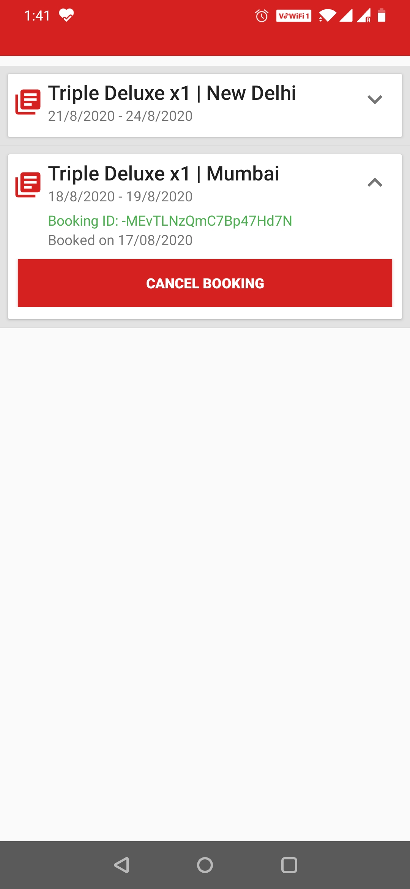

# Hotel Reservation System


This repository contains the source code for an Android Project which aims at facilitating online room reservation by the end user.

The bookings are stored over the cloud using Google Firebase.

## Getting Started

If you are unfamiliar with setting up Android Studio and Google Firebase, please follow these steps carefully.

### Prerequisites

* Android Studio
* Google Account

### Installing

#### Setup Android Studio

Download [Android Studio](https://developer.android.com/studio?hl=es) and install it on your PC.

After the installation is complete, open Android Studio and click on "Import existing project".

Browse to the directory where you have cloned this repository and import.

#### Setup Google Firebase




Navigate to [Google Firebase](https://firebase.google.com/) and login using your Google Account.

Use the same account to login in Android Studio (small icon in the upper right corner).

After authentication,  go to **Tools > Firebase**. A new pane opens on the right of the window.

Select **Authentication > Connect to Firebase**, and proceed.

Select **Authentication > Add Authentication to your App** and **Realtime Database > Add Realtime Database to your App**.

Navigate to [Firebase Console](https://console.firebase.google.com/) and select your project.

On the left pane, select **Authentication > Sign-in Method**. Enable *Email/Password* and *Google*.

Similarly, select **Database > Create Realtime Database > Rules** and change the rules as given below:

```
{
  "rules": {
    ".read": "true",
    ".write": "true"
  }
}
```

Head over to **Project Overview > Project Settings** and scoll down.

Download the **google_services.json** file and copy it to *projectdirectory/app*.

And, we're good to go!

## Deployment

#### Run on virtual machine

In Android Studio, **Open AVD Manager > Add new device**.

Setup your preferred device using *API 29+* and run.

#### Run on actual device

Make sure **USB Debugging** is turned on and connect your device to your PC.

After it appears in the list of available devices, click **Run**.

## Built With

* [Android Studio](https://developer.android.com/studio) - Official IDE for Android Development
* [Java](https://www.java.com/en/) - Back-end Development
* [Google Firebase](https://firebase.google.com/) - User Authentication and Cloud Storage

## Authors

* **Ishan Bhattacharya** - *Initial work* - [ishanbhattacharya](https://github.com/ishanbhattacharya)

See also the list of [contributors](https://github.com/ishanbhattacharya/hotel-management-app/contributors) who participated in this project.
